 

## ⚒️ A Lenda

> *"Todo sistema começa como metal bruto. Com fogo, paciência e muitos commits, vira lâmina."*

Sou **Adam Caldas**, desenvolvedor Full Stack e estudante de Ciência da Computação em Boa Vista, RR. Gosto de forjar **back-ends sólidos em Go**, interfaces rápidas em **Next.js** e de **automatizar tudo** que se repete mais de duas vezes.

  

## 🛡️ Arsenal

**⚔️ Armas principais**

**🔮 Grimório de dados**

**🏰 Fortaleza & infraestrutura**

**🧪 Encantamentos extras**

## 📜 Quadro de Missões

| | Missão | Descrição | Equipamento |
|:-:|---|---|---|
| 👑 | **IceGo Ultimate** | Missão principal: um ecossistema ERP completo, do estoque ao caixa | `Go` `TypeScript` |
| 🎓 | **[StudFy](https://github.com/AdamCaldas/Study)** | Back-end de estudos pronto para ~1000 alunos, com login via Keycloak e auditoria | `Go` `Gin` `GORM` `Keycloak` |
| 🩺 | **Prontuário Vivo** | SaaS de prontuário eletrônico para fisioterapeutas | `Next.js` `Supabase` |
| 🔐 | **Auth Service** | Serviço de autenticação: cadastro, confirmação por e-mail e recuperação de conta | `TypeScript` `Cloud Run` |
| 🎥 | **Sala** | Videochamada em tempo real no navegador, estilo Meet | `WebRTC` `Supabase Realtime` |
| 🕷️ | **Side quest** | Mineração de dados com web scraping e concorrência em Go | `Go` `Python` |

## 📊 Registro de Batalhas

  

**🍲 Habilidade passiva:** cozinhar um Chambaril absurdo — buff de **+50% de regeneração de HP**.

⚒️ Forjado em Boa Vista, RR · o fogo da forja nunca apaga

